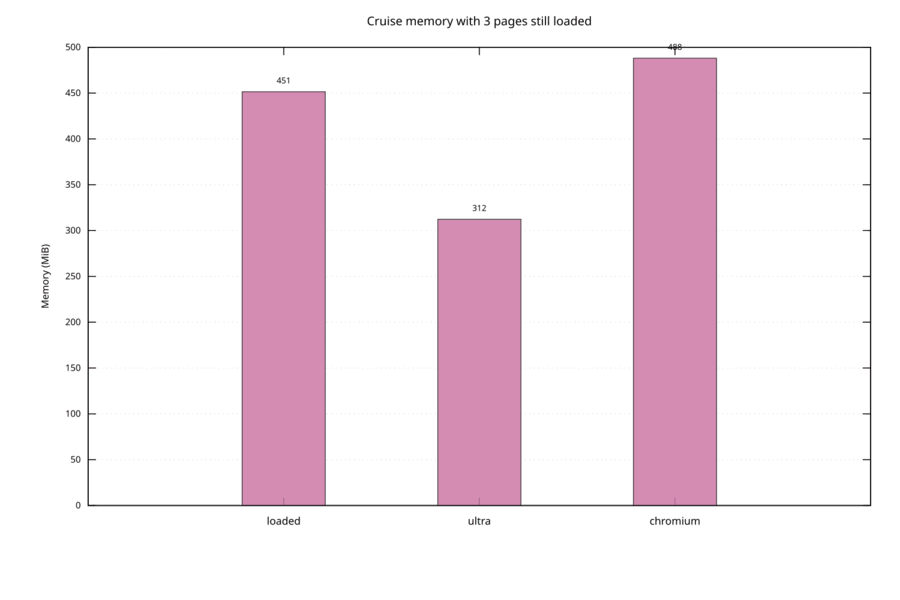
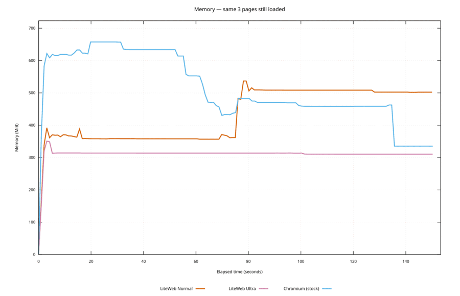
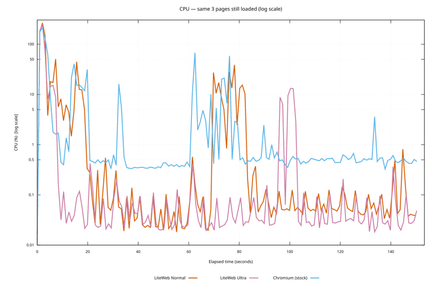
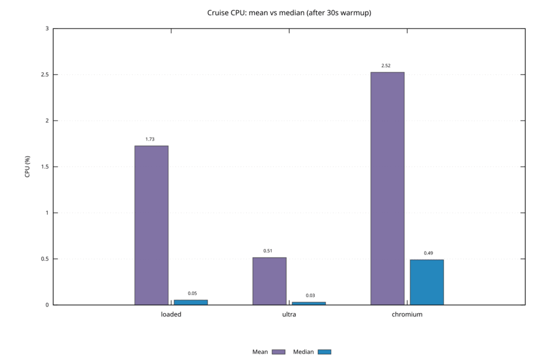

<p align="center">
  
</p>

# LiteWeb

Navigateur web léger pour Linux, optimisé pour la consommation de processeur, de mémoire et d'énergie.

> **Preview (v0.1).** Linux + WebKit système uniquement. Ce n'est pas un remplacement de Firefox/Chrome : pas de téléchargements, le filtre ne s'applique qu'aux navigations, et les sites qui exigent HTTP Basic ou beaucoup de popups casseront. À utiliser comme lecteur léger / navigateur économe.

## Fonctionnalités

- Navigation classique : retour, avant, rechargement et onglets
- Blocage des navigations vers des domaines publicitaires et de traçage (environ 50 domaines à fort impact)
- Modes économie d'énergie (Normal / Éco / Agressif / Ultra) avec suspension automatique des onglets inactifs
- Historique et favoris dans une base SQLite locale
- Raccourcis clavier et palette de commandes (`:`)

## Prérequis (Linux)

```bash
sudo apt install libwebkit2gtk-4.1-dev libgtk-3-dev libsqlite3-dev build-essential
```

## Compilation

```bash
cargo build --release
```

Le binaire se trouve dans `target/release/liteweb`.

## Lancement

```bash
./target/release/liteweb
```

Données utilisateur : `~/.config/liteweb/liteweb.db`

## Sécurité

- Navigation limitée à `http://`, `https://` et `about:blank` ; les schémas locaux ou actifs (`file:`, `data:`, `javascript:`) sont refusés. Une URI absente ou illisible est refusée.
- Les popups (`target=_blank`, `window.open`) ne créent jamais de WebView hors politique. Une URL autorisée s'ouvre dans un onglet LiteWeb ; le reste est ignoré. Les téléchargements et l'authentification HTTP Basic sont annulés tant que ces fonctions n'existent pas.
- Les permissions Web (caméra, microphone, géolocalisation, notifications) et les sélecteurs de fichiers sont refusés par défaut. Le plein écran est désactivé pour qu'une page ne puisse pas recouvrir la barre d'adresse.
- La sandbox WebKit est activée, les erreurs TLS bloquent le chargement, l'automatisation distante est désactivée et les cookies tiers sont refusés.
- La barre d'adresse se met à jour sur l'URL validée (pas seulement à la fin du chargement), affiche le punycode des hôtes IDN et retire les contrôles bidi. Les pages Ultra sont aplaties et servies avec une CSP stricte.
- Si `bwrap` est absent, la barre d'aide prévient que la sandbox WebKit ne peut pas démarrer.
- La base SQLite utilise le mode `0600` et les répertoires de profil le mode `0700` sous Unix. Les chemins de profil ou de base qui sont des liens symboliques sont refusés.

Le filtre intégré agit sur les navigations. Il ne remplace pas un bloqueur complet de sous-ressources de type EasyList. Voir `docs/security/2026-08-17-browser-audit.md`.

## Raccourcis clavier

| Raccourci | Action |
|---|---|
| `Ctrl+L` | Focus sur la barre d'adresse |
| `Ctrl+T` | Nouvel onglet |
| `Ctrl+W` | Fermer l'onglet |
| `Ctrl+Tab` | Onglet suivant |
| `Ctrl+Shift+Tab` | Onglet précédent |
| `Ctrl+R` / `F5` | Recharger |
| `Alt+←` / `Alt+→` | Retour / avant |
| `Ctrl+D` | Ajouter un favori |
| `Ctrl+Shift+E` | Changer le mode énergie |
| `:` | Palette de commandes |

## Commandes

```
:open example.com
:tab 2
:suspend
:suspend-all
:eco on|off|aggressive|ultra
:bookmark list
:history
```

## Modes énergie

| Mode | Suspension après | Onglets actifs maximum | Moteur de page |
|------|------------------|------------------------|----------------|
| Normal | 10 min | 20 | WebKit complet |
| Éco | 3 min | 10 | WebKit complet |
| Agressif | 1 min | 5 | WebKit complet |
| Ultra | 15 s | 1 | Sans JS, images, médias ni GPU ; page aplatie en mode lecture |

Les onglets suspendus libèrent leur WebView, ce qui réduit fortement l'usage de mémoire, et se réactivent au clic.

**Ultra** est le mode lecture / urgence. Il recharge les onglets vivants en article dépouillé (plus de JavaScript, d'images ni de médias). Les applications web qui exigent du JS seront vides ; revenir en arrière avec `Ctrl+Shift+E` ou `:eco off`.

## Benchmark de consommation

### Exemple de résultats (machine locale)

CPU/RAM du cgroup LiteWeb + enfants WebKit. Les **chiffres de croisière sont la moyenne arithmétique** des échantillons ~1 Hz de `warmup_complete` → `completed` (pas la médiane, pas un seul dernier sample). Le démarrage / chargement avant le warmup est exclu.

#### Suite suspension d’onglets (2026-08-11)

10 pages publiques fixes + 1 onglet blank sentinelle (`idle` = 1 onglet Google).

| Scénario | Tous les onglets suspendus | RAM avant → après | RAM économisée | CPU après (moyenne) |
|----------|---------------------------:|------------------:|---------------:|--------------------:|
| idle | — | 394 → 394 MiB | 0% | 0,07% |
| normal | 600,6 s | 1498 → 164 MiB | **89%** (−1,3 Gio) | 0,33% |
| agressif | 60,1 s | 1395 → 204 MiB | **85%** (−1,2 Gio) | 1,8% |

<p align="center">
  
</p>
<p align="center">
  
</p>
<p align="center">
  
</p>

#### Suite moteur vivant — Normal vs Ultra vs Chromium (2026-08-16 / 17)

Les 3 mêmes pages restent chargées (Wikipedia, rust-lang, HN) ; **pas de suspension d’onglets**. Warmup 30 s + mesure 120 s. Chromium = Google Chrome 151 stock (mêmes URLs, profil frais).

| Scénario | RAM croisière (moyenne) | CPU moyenne | CPU médiane | vs Chromium |
|----------|------------------------:|------------:|------------:|----------|
| chromium | 488 MiB | 2,52% | 0,49% | — |
| loaded (Normal) | 451,5 MiB | 1,74% | 0,05% | −7,5% RAM |
| ultra | 312,3 MiB | 0,52% | 0,03% | **−36% RAM**, **−80% CPU** |

<p align="center">
  
</p>
<p align="center">
  
</p>
<p align="center">
  
</p>
<p align="center">
  
</p>

Le **CPU moyenne** est `cpu_after_pct` sur la fenêtre post-warmup. Ce **n’est pas une médiane**. Les médianes restent quasi idle (dernier graphe) ; quelques pics tirent la moyenne. Ultra atténue surtout ces pics. Privilégier la moyenne pour le budget CPU une fois le navigateur ouvert.

**Lecture des gains**

- Le gain principal de la suite suspension est la **RAM** : un onglet suspendu libère sa WebView ; seul l’onglet blank actif garde un moteur vivant. D’où une RAM « après » parfois *inférieure* au baseline idle (Google encore chargé).
- **Normal** attend les 10 min d’inactivité, puis suspend les 10 pages d’un coup → plus grosse chute de mémoire, la plus « propre ».
- **Agressif** commence par la limite d’onglets actifs (~30 s, 6 onglets), puis le timeout 1 min (~60 s, 10/10) → même type d’économie, beaucoup plus tôt.
- **Ultra** se compare à **loaded** et à **Chromium stock**, pas à la RAM après suspension : les 3 mêmes pages restent vivantes ; Ultra ne fait que dépouiller le moteur (plus de JS/images/médias/GPU, article aplati). Lancer `./scripts/benchmark_ultra.sh` puis `./scripts/benchmark_chromium.sh --output …`.
- Le **CPU** reste bas une fois suspendu ; les pics de chargement ne comptent pas dans les fenêtres de croisière. Le banc mesure CPU/RAM cgroup, pas les watts à la prise, et n’attribue pas l’économie CPU uniquement à un throttling JavaScript.
- Les chiffres dépendent de la machine et du poids réel des pages ; relancer localement pour ton matériel.

### Lancer le benchmark

```bash
# Suite suspension 10 onglets (~15 min)
./scripts/benchmark_consumption.sh
./scripts/visualize_benchmark.sh benchmark-results/run-YYYYMMDD-HHMMSS

# Les 3 mêmes pages, Normal vs Ultra (~5 min) — graphes loaded/ultra
./scripts/benchmark_ultra.sh

# Superposer Ultra / Chromium sur un run de suspension existant
./scripts/visualize_benchmark.sh benchmark-results/run-YYYYMMDD-HHMMSS \
    --also benchmark-results/ultra-YYYYMMDD-HHMMSS

# Chromium stock, mêmes 3 pages (~2,5 min) ; ajouter dans le dossier Ultra
./scripts/benchmark_chromium.sh --output benchmark-results/ultra-YYYYMMDD-HHMMSS
```

Session graphique, profil frais par scénario. Sorties CSV + `summary.md` sous `benchmark-results/`. Pour comparer : secteur, luminosité fixe, pas d’autres navigateurs lourds.

## Architecture

- **Rust** + **WebKitGTK 4.1** + **GTK3**
- Moteur WebKit partagé avec le système, plus léger que Chromium
- Cache désactivé, préchargement DNS désactivé et lecture automatique des médias bloquée par défaut

## Logo

Le logo a été généré avec **Grok Image** et recadré au format 1:1 pour l'icône de LiteWeb.

## Feuille de route

- [ ] Téléchargements de fichiers
- [ ] Mise à jour automatique des filtres EasyList
- [ ] Port Windows (WebView2) / macOS (WKWebView)
- [ ] GTK4 + libadwaita (lorsqu'ils seront disponibles sur la plateforme cible)
