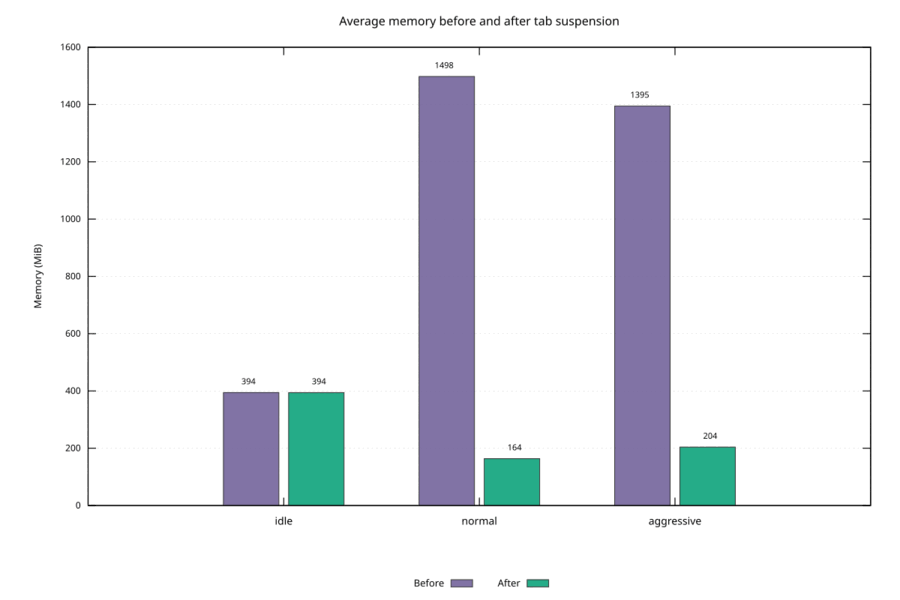
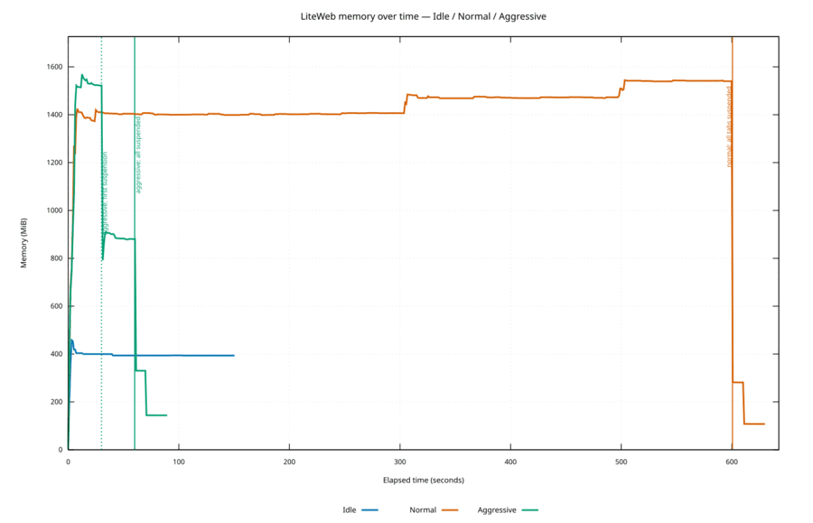
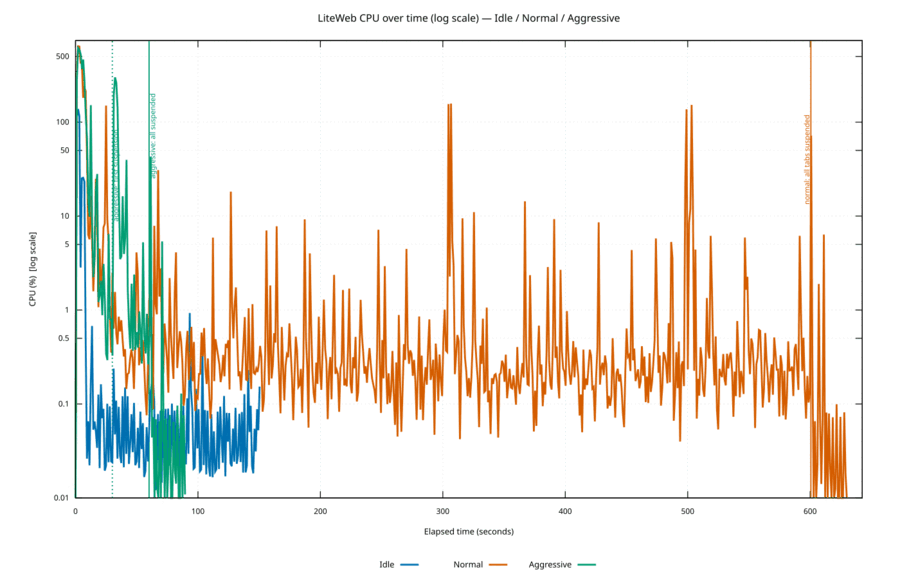

<p align="center">
  
</p>

# LiteWeb

Lightweight Linux web browser optimized for CPU, memory, and energy usage.

## Features

- Standard navigation (back, forward, reload, tabs)
- Blocks navigation to advertising and tracking domains (~50 high-impact domains)
- Energy-saving modes (Normal / Eco / Aggressive) with automatic suspension of inactive tabs
- History and bookmarks (local SQLite)
- Keyboard shortcuts and a command palette (`:`)

## Requirements (Linux)

```bash
sudo apt install libwebkit2gtk-4.1-dev libgtk-3-dev libsqlite3-dev build-essential
```

## Build

```bash
cargo build --release
```

The binary is located at `target/release/liteweb`.

## Run

```bash
./target/release/liteweb
```

User data: `~/.config/liteweb/liteweb.db`

## Security

- Navigation is limited to `http://`, `https://`, and `about:blank`; local or active schemes (`file:`, `data:`, `javascript:`) are rejected.
- Web permissions (camera, microphone, geolocation, notifications) and file choosers are denied by default.
- WebKit sandboxing is enabled, TLS errors are blocking, and remote automation is disabled.
- The SQLite database uses mode `0600` and profile directories use mode `0700` on Unix.

The built-in filter applies to navigations. It is not a complete subresource blocker such as EasyList.

## Keyboard shortcuts

| Shortcut | Action |
|---|---|
| `Ctrl+L` | Focus the address bar |
| `Ctrl+T` | New tab |
| `Ctrl+W` | Close tab |
| `Ctrl+Tab` | Next tab |
| `Ctrl+Shift+Tab` | Previous tab |
| `Ctrl+R` / `F5` | Reload |
| `Alt+←` / `Alt+→` | Back / forward |
| `Ctrl+D` | Add a bookmark |
| `Ctrl+Shift+E` | Change energy mode |
| `:` | Command palette |

## Commands

```
:open example.com
:tab 2
:suspend
:suspend-all
:eco on|off|aggressive
:bookmark list
:history
```

## Energy modes

| Mode | Suspend after | Maximum active tabs |
|------|---------------|---------------------|
| Normal | 10 min | 20 |
| Eco | 3 min | 10 |
| Aggressive | 1 min | 5 |

Suspended tabs release their WebView (a significant memory saving) and resume when clicked.

## Consumption benchmark

### Sample results (local run, 2026-08-11)

Cgroup CPU/RAM for LiteWeb + WebKit children. Workload: 10 fixed public pages + 1 blank sentinel (except idle = 1 Google tab).

| Scenario | All tabs suspended | RAM before → after | RAM saved | CPU after |
|----------|-------------------:|-------------------:|----------:|----------:|
| idle | — | 394 → 394 MiB | 0% | 0.07% |
| normal | 600.6 s | 1498 → 164 MiB | **89%** (−1.3 GiB) | 0.33% |
| aggressive | 60.1 s | 1395 → 204 MiB | **85%** (−1.2 GiB) | 1.8% |

<p align="center">
  
</p>
<p align="center">
  
</p>
<p align="center">
  
</p>

**What the gains mean**

- Most of the win is **RAM**: suspended tabs drop their WebView; only the active blank tab keeps a live engine. That is why after-suspension memory can fall *below* the idle Google baseline.
- **Normal** waits the full 10 min inactivity timeout, then suspends all 10 pages at once → largest, cleanest memory drop.
- **Aggressive** hits the max-active-tabs limit first (~30 s, 6 tabs), then the 1 min timeout (~60 s, 10/10) → same kind of saving, much sooner.
- **CPU** after suspension stays low; startup/load spikes are excluded from the “after” window. The benchmark measures cgroup CPU/RAM, not wall-power watts, and does not claim JS throttling as the source of CPU savings.
- Numbers depend on machine load and live page weight; re-run locally for your hardware.

### How to run

```bash
./scripts/benchmark_consumption.sh
./scripts/visualize_benchmark.sh benchmark-results/run-YYYYMMDD-HHMMSS   # needs gnuplot
```

~15 min, graphical session, fresh profile per scenario. Outputs CSV + `summary.md` under `benchmark-results/`. For comparable runs: AC power, fixed brightness, no other heavy browsers.

## Architecture

- **Rust** + **WebKitGTK 4.1** + **GTK3**
- System-shared WebKit engine (lighter than Chromium)
- Cache disabled, DNS prefetch disabled, and media autoplay blocked by default

## Logo

The logo was generated with **Grok Image** and cropped to a 1:1 aspect ratio for the LiteWeb icon.

## Roadmap

- [ ] File downloads
- [ ] Automatic EasyList filter updates
- [ ] Windows (WebView2) / macOS (WKWebView) ports
- [ ] GTK4 + libadwaita (when available on the target platform)
